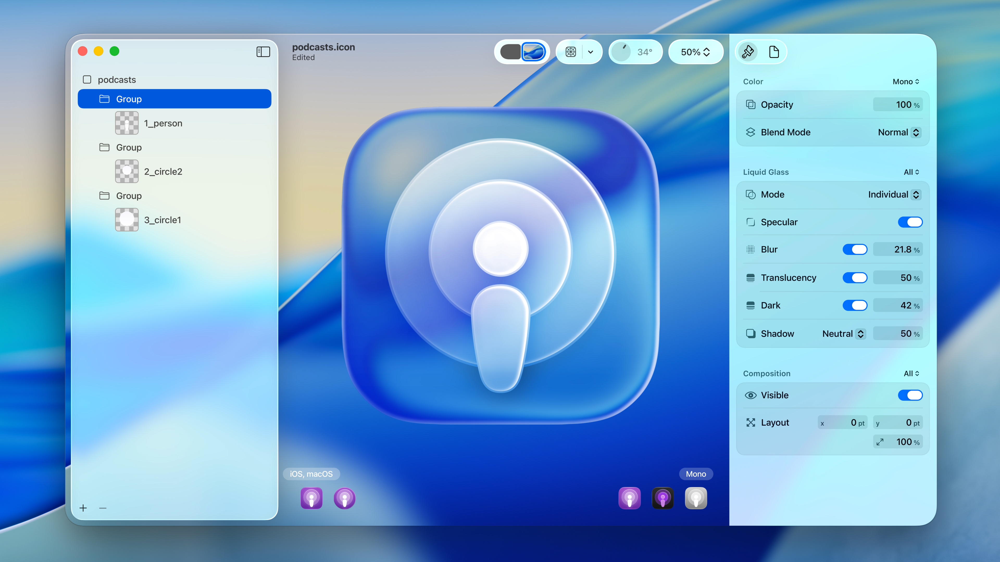
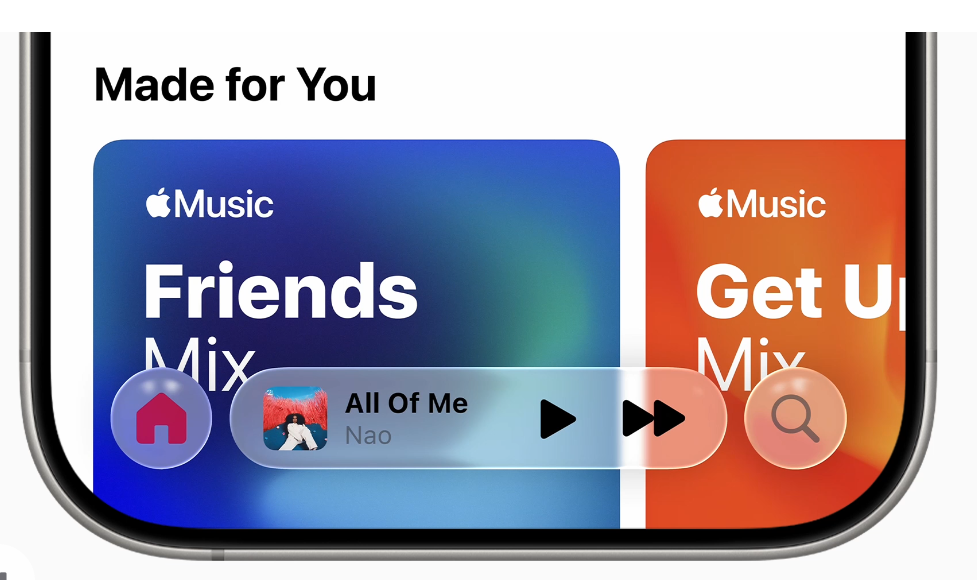

# Requirements for PDF Reader UI Design

1. Buttons need to be closer together
2. Summary button opens a retractil windows with the summary of the pdf
3. research button opens a retractil window with a search bar to search for items in the document
4. Use kindle UI as an example for the layout of the retractil menus (sumário e pesquisa)
5. apply color scheme from apple's liquid glass design as it is in the uploaded content
6. Menus 1 and 2 should be on the side of the document, differently from the kindle layout.
7. Design should be simple and modern, following the liquid glass design from apple. transparent buttons that get bigger when hovered, touched and dragged.

